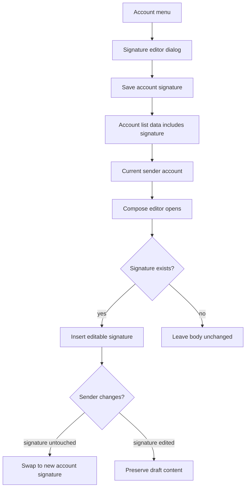

# feat: Add per-account email signatures

## Summary

Add rich-text signatures owned by individual email accounts. Users can configure a signature from the account-management menu, and compose flows automatically insert the selected account's signature into new messages, replies, and forwards without overwriting user-edited draft content.

---

## Problem Frame

Cloud Mail already lets one user send from multiple email accounts. Those accounts can represent different roles, domains, or identities, so a single user-level signature would be too coarse. The feature should extend the existing account identity model and compose flow instead of adding a separate global settings area.

---

## Requirements

**Signature Storage and Permissions**

- R1. Each email account stores zero or one rich-text signature.
- R2. Users can create, edit, clear, and save signatures only for email accounts they own.
- R3. Admins follow the same account ownership rules used by sending; v1 does not add a cross-account admin signature-edit bypass.
- R4. Empty signatures are stored as `null` and suppress auto-insertion for that account.

**Signature Editing**

- R5. Signature editing is reachable from the existing account settings menu.
- R6. The editor supports rich-text content consistent with the existing compose editor.
- R7. Saving a signature gives clear success or failure feedback.

**Compose Behavior**

- R8. New compose windows auto-insert the current sender account's signature when one exists.
- R9. Replies and forwards place the signature above quoted or forwarded content.
- R10. Changing sender account through an explicit compose sender selector swaps the auto-inserted signature only when the previous signature has not been materially edited.
- R11. User-authored draft content must not be unexpectedly overwritten after the user edits or removes inserted signature content.

**Regression Coverage**

- R12. Backend coverage verifies account ownership, persistence, clearing, and list visibility for signatures.
- R13. Frontend regression coverage verifies signature editing entry points and compose insertion safety for new mail, replies, forwards, and sender changes. If automated browser tooling is not added in this feature, these scenarios must be captured as named manual checks and treated as release gates, not optional notes.

---

## Key Technical Decisions

- **Store signature on the account identity:** The origin requires per-email-account signatures, and `account` is already the sender identity used by account lists and compose.
- **Extend existing account APIs rather than add a new settings domain:** Account signature edits share account ownership rules with other account actions, but their route and permission mapping must be explicit instead of inferred from existing mutations.
- **Treat inserted signature as editable compose content:** The compose editor should not lock a signature block; safety comes from tracking whether the app-inserted signature is still unchanged before swapping it. Tracking markers must not be sent or displayed in final email HTML.
- **Apply signature insertion on the client:** The user must see and edit the signature before send. Backend send should continue sending the final HTML produced by compose.
- **Add migration through the existing init pipeline:** The app currently evolves D1 schema through versioned `init` functions, so signature persistence should follow that pattern.
- **Use one canonical HTML safety policy:** Signature HTML must follow the same allowlist and sanitization policy as compose HTML, with explicit handling for tags, attributes, CSS, URL protocols, image/data URLs, storage, editor insertion, send, and rendered mail display.

---

## High-Level Technical Design

The feature has two flows: account signature management and compose-time insertion.

For replies and forwards, the quote/forward content remains generated by the existing compose flow, but the signature insertion point is before that quoted content.

Compose sender changes are triggered only by a sender selector inside the compose dialog. Sidebar mailbox/account navigation must not mutate an already-open compose draft's sender or signature. If adding that selector is too large for v1, sender-change swapping should be removed from v1 scope rather than implemented as an implicit watcher.

The editor body order is:

1. Editable blank user message area with the caret placed at the start.
2. Existing app-managed signature block, when present.
3. Quoted or forwarded content, for reply and forward flows.

---

## Implementation Units

### U1. Account Signature Persistence and API

- **Goal:** Add backend support for storing, listing, and updating a rich-text signature on each owned account.
- **Requirements:** R1, R2, R3, R4, R12; supports F1 from the origin.
- **Dependencies:** None.
- **Files:**
  - `mail-worker/src/entity/account.js`
  - `mail-worker/src/init/init.js`
  - `mail-worker/src/service/account-service.js`
  - `mail-worker/src/api/account-api.js`
  - `mail-worker/src/security/security.js`
  - `mail-worker/test/index.spec.js`
- **Approach:** Extend the existing account model and initialization flow with a nullable `signature` field. Add `PUT /account/setSignature` as an account-owned update operation. Add the route to `security.js` explicitly, using the same authenticated send/account-ownership capability as account rename unless implementation discovers a stricter existing permission is required. Do not rely on admin bypass for v1 signature edits: users, including admins, may update only accounts they can send from under existing ownership rules.
- **Patterns to follow:** `accountSetName` / `accountService.setName` for ownership-scoped account mutation; `init.js` versioned schema additions for D1 evolution; `result.ok` response wrapping in account APIs.
- **Test scenarios:**
  - Covers F1. Given an authenticated user owns an account, updating its signature persists rich-text HTML and returns success.
  - Given a user owns an account with a saved signature, `/account/list` includes that signature for compose and account settings use.
  - Given admin or user-management account-list responses exist outside `/account/list`, those responses omit `signature` unless they are explicitly used by compose/account settings.
  - Given an account has a signature, saving an empty signature persists `null` and later list results show no insertable signature.
  - Given a user tries to update an account owned by another user, the operation is rejected or leaves the other account unchanged.
  - Given an admin tries to update a signature for an account they do not own/send from, the operation follows the same ownership rejection path as normal users.
  - Given malicious HTML is saved as a signature, unsafe tags, attributes, URLs, scripts, SVG/event payloads, and style injection are removed or inert according to the canonical compose/signature HTML policy.
  - Given the initialization endpoint runs on an existing database, `pragma_table_info('account')` and a post-init Drizzle write/read prove the signature field exists and maps correctly without breaking existing account rows.
- **Verification:** Account list and mutation behavior expose signatures only through authenticated account ownership paths, initialization remains idempotent, and the migration cannot be silently skipped by the init pipeline's catch-and-continue behavior.

### U2. Account Menu Signature Editor

- **Goal:** Let users edit each account's rich-text signature from the existing account settings menu.
- **Requirements:** R5, R6, R7, R13; supports F1 from the origin.
- **Dependencies:** U1.
- **Files:**
  - `mail-vue/src/layout/account/index.vue`
  - `mail-vue/src/request/account.js`
  - `mail-vue/src/components/tiny-editor/index.vue`
  - `mail-vue/src/i18n/en.js`
  - `mail-vue/src/i18n/zh.js`
- **Approach:** Add a "Signature" action to each sendable account's existing dropdown, ordered near rename because both edit account identity metadata. Reuse the rich-text editor component for signature content, with a dialog sized and labeled for signature editing rather than full message composition. The dialog needs explicit desktop/mobile dimensions, a usable editor height, save/cancel buttons, loading/disabled states, unsaved-change close handling, focus return to the opener, and accessible labels for icon-only controls. After save, update the local account object so compose can use the latest value without a full refresh.
- **Patterns to follow:** Existing rename dialog and account dropdown structure in `layout/account/index.vue`; existing success/error message behavior; existing TinyMCE component setup.
- **Test scenarios:**
  - Covers F1. Opening an account's settings menu exposes a signature action for accounts the user can send from.
  - Saving rich-text content updates the account's local signature value and shows success feedback.
  - Clearing the editor and saving removes the signature for that account.
  - Backend save failure leaves the local account signature unchanged and surfaces failure feedback.
  - The dialog labels render correctly in English and Chinese locales, and keyboard/focus behavior works for opening, saving, cancelling, and returning focus.
- **Verification:** Users can discover signature editing where they already manage sender accounts, and saved changes are reflected in the current account state.

### U3. Compose Signature Insertion

- **Goal:** Insert the selected account's signature into new compose, reply, and forward flows while preserving user edits.
- **Requirements:** R8, R9, R10, R11, R13; supports F2, F3, and F4 from the origin.
- **Dependencies:** U1, U2.
- **Files:**
  - `mail-vue/src/layout/write/index.vue`
  - `mail-vue/src/store/account.js`
  - `mail-vue/src/components/tiny-editor/index.vue`
  - `mail-vue/src/db/db.js`
- **Approach:** Introduce a compose-local sender selector and a small compose-side signature state that records what the app inserted and whether it remains untouched. For new mail, start with an editable blank message area, then the signature when present, with the caret in the blank user area. For replies and forwards, compose the body as editable user area plus signature plus quote/forward content. When the compose sender selector changes, swap signatures only if the existing inserted signature still matches the app-managed signature state; otherwise preserve all draft body content. Sidebar account changes while compose is open must not swap sender/signature.
- **Technical design:** Directional state model:
  - `insertedSignature`: the last app-inserted signature HTML.
  - `signatureDirty`: whether current editor content no longer contains the app-managed signature in its expected position.
  - `signatureAnchor`: placement marker or equivalent tracking concept that helps distinguish app-managed signature content from user-authored body content. Any marker must be stripped before send and must not be visible in sent/read mail.
  - Drafts do not automatically re-apply or swap signatures on reopen. If signature metadata is persisted with local drafts, it must be versioned and ignored when the saved HTML no longer matches the current editor content after TinyMCE normalization.
- **Patterns to follow:** Existing `defValue` watcher for TinyMCE content; `backReply` snapshot logic for close/draft prompts; current account selection in `open()`.
- **Test scenarios:**
  - Covers AE1. Opening a new compose window from an account with a signature inserts it into the editable body.
  - Covers AE2. Opening a reply inserts the signature above the quoted original message.
  - Opening a forward inserts the signature above forwarded content.
  - Covers AE3. Changing sender through the compose sender selector before editing the inserted signature swaps Account A's signature for Account B's signature.
  - Covers AE4. Changing sender through the compose sender selector after editing body text, editing the signature, or deleting the inserted signature preserves the user's draft content.
  - Opening a draft preserves saved draft content and does not re-add or swap signatures unexpectedly, including after sender changes following a draft reopen.
  - Accounts without signatures do not add placeholder markup or empty blocks.
  - TinyMCE round-trips signatures with links, images, formatting wrappers, and duplicate signature-like body content without false clean/dirty decisions.
- **Verification:** Compose behavior matches the origin acceptance examples and does not overwrite edited content during sender changes or draft reopen.

### U4. Feature-Level Regression Coverage

- **Goal:** Cover the visible user flows that unit tests cannot prove, while keeping test infrastructure proportional to the feature.
- **Requirements:** R13; covers F1, F2, F3, and F4 from the origin.
- **Dependencies:** U1, U2, U3.
- **Files:**
  - `mail-vue/package.json` (only if adding a committed runner)
  - `mail-vue/vite.config.js` (only if adding a committed runner)
  - `mail-vue/src/layout/account/index.vue`
  - `mail-vue/src/layout/write/index.vue`
  - `mail-vue/tests/account-signature.spec.js` (only if adding a committed runner)
- **Approach:** Choose one verification path before implementation starts. Preferred path: add a minimal Playwright-based browser test setup that runs against the Worker dev server serving built Vue assets and uses deterministic local admin/two-account fixtures. Fallback path: do not edit frontend test tooling; instead record the same named scenarios as a manual release checklist. The fallback is acceptable only if the implementation stays small and the manual checklist is completed before release.
- **Patterns to follow:** Vue/Vite testing conventions if introduced; existing component boundaries and i18n keys.
- **Test scenarios:**
  - Covers AE1. After saving a signature for an account, opening compose shows the signature.
  - Covers AE2. Replying shows the signature above quoted content.
  - Covers AE3. Sender change swaps untouched signatures.
  - Covers AE4. Sender change preserves edited signature/draft content.
  - Clearing a signature stops future auto-insertion.
  - Malicious signature HTML remains removed or inert in the editor, compose body, sent mail, and read-mail display.
- **Verification:** The primary user flows are covered by committed browser tests, or the exact same checks are recorded as a named manual release checklist with the reason automated tooling was deferred.

### U5. Manual Verification and Local Dev Notes

- **Goal:** Verify the full local Cloudflare Worker + Vue asset flow after implementation.
- **Requirements:** R12, R13.
- **Dependencies:** U1, U2, U3, U4.
- **Files:**
  - `README.md` (only if visible setup or usage changes)
  - `README-en.md` (only if visible setup or usage changes)
- **Approach:** Add documentation only if the new signature feature changes visible setup or usage. At minimum, manually verify with initialized local D1/KV, an admin account, and at least two sender accounts so per-account behavior and sender-change behavior are exercised.
- **Patterns to follow:** Existing README feature-list style if a documentation update is warranted.
- **Test scenarios:**
  - Local initialized app can save distinct signatures for two accounts and auto-insert the correct one.
  - Local initialized app can clear one account signature without affecting another account.
  - Local compose sender selector can swap untouched signatures and preserve edited draft/signature content.
  - Existing send flow still sends the final edited HTML body.
- **Verification:** Manual check confirms account editing, compose, reply, forward, and sender-change flows in the running app.

---

## Scope Boundaries

### In Scope

- Per-account rich-text signature storage and editing.
- Auto-insertion in new compose, reply, and forward flows.
- Sender-change safety that avoids overwriting user edits.
- A compose-local sender selector if sender-change swapping remains in v1.
- Backend and frontend regression coverage or named release-gate manual checks for the feature-bearing paths.

### Deferred to Follow-Up Work

- Manual "insert signature" command.
- Multiple signature templates per account.
- Admin-managed shared signature templates or enforced legal disclaimers.
- Organization-wide branding controls or signature analytics.
- Implicit sender changes driven by sidebar mailbox navigation while compose is open.

---

## System-Wide Impact

- **Persistent data:** Existing D1 databases need a backward-compatible account schema addition through the initialization flow.
- **Auth and ownership:** Signature mutation must preserve current account ownership boundaries.
- **Compose drafts:** Draft save/reopen behavior must remain stable because signatures become part of editable content.
- **Localization:** New visible labels and messages need English and Chinese translations.
- **Accessibility:** New account menu action, dialog, editor, and compose sender selector need keyboard access, focus management, and accessible names.

---

## Risks and Dependencies

- **Rich-text safety:** Signature HTML is user-authored rich text and will travel through the same message body path as compose content. The implementation must define and verify one canonical HTML policy for compose and signatures rather than silently trusting TinyMCE output.
- **Editor timing:** TinyMCE initialization and `defValue` updates are asynchronous. Signature insertion should avoid races where a later editor init overwrites content.
- **Sender-change detection:** Detecting "materially edited" signatures can be brittle if based on naive string equality. The implementation should choose a stable marker or tracking strategy and include regression tests for edited and untouched cases.
- **Frontend test tooling:** The Vue app currently has no obvious test runner. Adding one should stay narrow and not become a broad testing infrastructure project.
- **Backend test tooling:** The Worker test setup appears scaffolded and may need command/config repair before D1/KV integration tests can run; make that repair explicit if U1 tests are implemented through Vitest.

---

## Acceptance Examples

- AE1. New compose from a signed account inserts that account's signature into editable content.
- AE2. Reply from a signed account places the signature above quoted content.
- AE3. Compose sender selector change swaps untouched auto-inserted signatures.
- AE4. Compose sender selector change preserves draft content after signature or body edits.

---

## Sources and Research

- Origin requirements: `mail-worker/docs/brainstorms/2026-06-01-account-signatures-requirements.md`
- Account model and service patterns: `mail-worker/src/entity/account.js`, `mail-worker/src/service/account-service.js`, `mail-worker/src/api/account-api.js`
- Permission routing: `mail-worker/src/security/security.js`
- Schema evolution pattern: `mail-worker/src/init/init.js`
- Account settings UI: `mail-vue/src/layout/account/index.vue`
- Compose, reply, forward, and draft behavior: `mail-vue/src/layout/write/index.vue`
- Rich-text editor wrapper: `mail-vue/src/components/tiny-editor/index.vue`
- Localization files: `mail-vue/src/i18n/en.js`, `mail-vue/src/i18n/zh.js`

## Release-Gate Manual Checks

Automated browser coverage is deferred for v1 because the Vue app does not currently have committed browser-test infrastructure, and this pass kept verification proportional to the existing project setup. Before release, run these checks against a locally initialized Worker + Vue build with one user and at least two sender accounts:

- MG1. Save a rich-text signature for Account A from the account settings menu; open a new compose window from Account A and confirm the signature appears in editable content.
- MG2. Save a different signature for Account B; open compose from Account A, switch the compose sender selector to Account B before editing the inserted signature, and confirm Account A signature is replaced by Account B signature.
- MG3. Edit body text while leaving the inserted signature untouched, switch sender, and confirm the untouched signature swaps while body text remains.
- MG4. Edit or delete the inserted signature, switch sender, and confirm the draft content is preserved without replacing user-edited content.
- MG5. Reply to a received email and confirm the signature appears above quoted content.
- MG6. Forward an email and confirm the signature appears above forwarded content.
- MG7. Clear Account A signature, open a new compose window from Account A, and confirm no placeholder or empty signature block is inserted.
- MG8. Save malicious signature HTML containing script/event/javascript/style-url payloads, then confirm account save, compose insertion, send, and read-mail display keep the unsafe content removed or inert.
- MG9. Save a draft containing a signature, reopen it, and confirm the saved body is preserved and sender changes do not reapply or swap signatures unexpectedly.

